# CBDC Banking Simulation: Agent Interaction Mermaid Charts

## Main Agent Interaction Flow

```mermaid
graph TB
    %% Agent Definitions
    CB[Central Bank<br/>💎 CBDC Issuer<br/>Monetary Policy]
    LB[Large Banks<br/>🏛️ 20% of institutions<br/>60% market capital]
    SB[Small-Medium Banks<br/>🏪 80% of institutions<br/>40% market capital]
    C[Consumers<br/>👥 Portfolio Managers<br/>Adoption Decision Makers]
    
    %% Central Bank to Banks
    CB -->|Monetary Policy<br/>Interest Rates<br/>Regulatory Oversight| LB
    CB -->|Monetary Policy<br/>Interest Rates<br/>Regulatory Oversight| SB
    CB -->|CBDC Competition<br/>Market Disruption<br/>Systemic Risk Monitor| LB
    CB -->|CBDC Competition<br/>Market Disruption<br/>Systemic Risk Monitor| SB
    
    %% Central Bank to Consumers
    CB -->|CBDC Issuance<br/>1% Interest Rate<br/>Adoption Incentives| C
    CB -->|Digital Currency<br/>Convenience Features<br/>Network Effects| C
    
    %% Banks to Consumers
    LB -->|Deposit Services 2%<br/>Loan Products 5%<br/>Traditional Banking| C
    SB -->|Deposit Services 2%<br/>Loan Products 5%<br/>Traditional Banking| C
    LB -->|High Customer Stickiness 70%<br/>Brand Loyalty<br/>Service Quality| C
    SB -->|Low Customer Stickiness 30%<br/>Limited Resources<br/>Vulnerability| C
    
    %% Consumer Feedback
    C -->|Deposit Flows $1,850<br/>Customer Attrition<br/>Service Demand| LB
    C -->|Deposit Flows $1,850<br/>Customer Attrition<br/>Service Demand| SB
    C -->|CBDC Adoption 3%<br/>Usage Patterns<br/>Market Response| CB
    
    %% Interbank Relationships
    LB -.->|Interbank Lending<br/>60% Network Connectivity<br/>High Centrality 0.8| SB
    SB -.->|Interbank Borrowing<br/>30% Network Connectivity<br/>Low Centrality 0.3| LB
    
    %% Competitive Dynamics
    LB <-->|Interest Rate Competition<br/>Market Share Battle<br/>CBDC Response| SB
    
    %% Network Effects
    C -.->|Peer Influence<br/>Social Learning<br/>Adoption Pressure| C
    
    %% Styling
    classDef centralBank fill:#FFD700,stroke:#333,stroke-width:3px
    classDef largeBank fill:#87CEEB,stroke:#333,stroke-width:2px
    classDef smallBank fill:#98FB98,stroke:#333,stroke-width:2px
    classDef consumer fill:#FFB6C1,stroke:#333,stroke-width:2px
    
    class CB centralBank
    class LB largeBank
    class SB smallBank
    class C consumer
```



## Detailed Pre-CBDC Phase Interactions

```mermaid
sequenceDiagram
    participant CB as Central Bank
    participant LB as Large Banks
    participant SB as Small Banks
    participant C as Consumers
    
    Note over CB,C: Pre-CBDC Phase (Steps 1-29)
    
    %% Initial Setup
    CB->>LB: Set monetary policy (2% base rate)
    CB->>SB: Set monetary policy (2% base rate)
    CB->>CB: Monitor banking system health
    
    %% Consumer-Bank Relationships
    C->>LB: Random assignment (initial banking)
    C->>SB: Random assignment (initial banking)
    LB->>C: Accept deposits ($1,850 avg per consumer)
    SB->>C: Accept deposits ($1,850 avg per consumer)
    
    %% Banking Operations
    LB->>C: Offer loans (5% interest rate)
    SB->>C: Offer loans (5% interest rate)
    LB->>LB: Build reserves (20% of capital)
    SB->>SB: Build reserves (20% of capital)
    
    %% Interbank Network
    LB<-->SB: Establish interbank connections
    LB->>LB: High connectivity (60% of network)
    SB->>SB: Lower connectivity (30% of network)
    
    %% Market Dynamics
    C->>C: Economic activity (2% income, 1.5% spending)
    LB->>SB: Compete for market share
    CB->>LB: Monitor bank performance
    CB->>SB: Monitor bank performance
```

## CBDC Introduction and Impact Phase


## Consumer Decision Process Detail

```mermaid
flowchart TD
    Start([Consumer Decision Cycle])
    
    %% Economic Activity
    Start --> Income[Receive Monthly Income<br/>2% ± 0.5% of wealth]
    Income --> Spend[Monthly Spending<br/>1.5% ± 0.5% of wealth]
    
    %% CBDC Evaluation
    Spend --> CBDCAvail{CBDC Available?}
    CBDCAvail -->|No| BankOnly[All funds to bank deposits<br/>37% wealth allocation]
    CBDCAvail -->|Yes| Evaluate[Evaluate CBDC Adoption]
    
    %% Decision Factors
    Evaluate --> Interest[Interest Rate Comparison<br/>CBDC 1% vs Bank 2%]
    Evaluate --> Social[Social Influence<br/>Peer adoption rate × 0.3]
    Evaluate --> Convenience[Convenience Factor<br/>Personal preference weight]
    Evaluate --> Risk[Risk Aversion<br/>μ=0.5, σ=0.2]
    Evaluate --> Loyalty[Bank Loyalty<br/>μ=0.7, σ=0.2]
    
    %% Adoption Decision
    Interest --> Decide{Adopt CBDC?}
    Social --> Decide
    Convenience --> Decide
    Risk --> Decide
    Loyalty --> Decide
    
    %% Outcomes
    Decide -->|Yes| Adopt[Become CBDC Adopter<br/>Rebalance portfolio]
    Decide -->|No| StayBank[Maintain bank relationship]
    
    %% Portfolio Management
    Adopt --> Rebalance[Portfolio Rebalancing<br/>Bank deposits ↔ CBDC]
    StayBank --> BankRelation[Update banking relationship]
    BankOnly --> BankRelation
    
    %% Loop Back
    Rebalance --> UpdateBank[Update primary bank<br/>Customer lists]
    BankRelation --> UpdateBank
    UpdateBank --> Start
    
    %% Styling
    classDef decision fill:#FFE4B5,stroke:#333,stroke-width:2px
    classDef action fill:#E0E0E0,stroke:#333,stroke-width:1px
    classDef outcome fill:#98FB98,stroke:#333,stroke-width:2px
    
    class CBDCAvail,Decide decision
    class Income,Spend,Evaluate,Interest,Social,Convenience,Risk,Loyalty,Rebalance,UpdateBank action
    class BankOnly,Adopt,StayBank,BankRelation outcome
```



## Banking System Network Structure


## Hypothesis Testing Framework

```mermaid
mindmap
  root((CBDC Impact<br/>Hypotheses))
    H1[H1: Network Centrality]
      Large Banks
        Maintain centrality 0.8
        Strong network position
        Resource advantages
      Small Banks
        Lose centrality 0.3→lower
        Peripheral position
        Higher vulnerability 80%
    H3[H3: Liquidity Stress]
      Systemic Risk
        Banking system health
        Deposit outflows
        Liquidity ratios
      Stress Indicators
        >30% weak banks threshold
        Central bank intervention
        Crisis periods
    H4[H4: Network Connectivity]
      Interbank Density
        Large banks 60% connected
        Small banks 30% connected
        Network fragmentation
      Connection Changes
        CBDC disruption
        Reduced intermediation
        Direct relationships
    H6[H6: Central Bank Dominance]
      Network Position
        Minimal initially 0.1
        Growth with CBDC adoption
        Direct consumer relationships
      Dominance Metrics
        Adoption rate boost 60%
        Market share boost 40%
        Monopoly position 20%
```



## Key Model Metrics and Data Flow


## Usage Instructions

### For Documentation
1. Copy the Mermaid code blocks into any Markdown viewer that supports Mermaid
2. Use in GitHub README files or documentation platforms
3. Export as images for presentations or papers

### For Development
1. Use these charts to understand interaction patterns
2. Reference when debugging agent behaviors
3. Validate model implementation against these specifications

### For Analysis
1. Compare actual simulation results against these interaction patterns
2. Use for hypothesis validation
3. Identify unexpected behaviors or missing connections